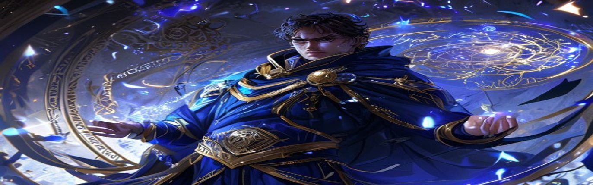

  

  

 

  

 

## Arcane Profile

I am **Nguyen Hong Son**, a software engineer from **Vietnam**, known in the guild ledger as **Zyrkael**. I craft digital realms where interfaces feel refined, backend systems stay disciplined, and complexity is bound into maintainable structure. My favored schools of magic are **React / Next.js** for illusion and interaction, and **.NET Core / C#** for logic, defense, and long-form architecture.

- Current quest: strengthening authentication rituals and real-time communication circles.
- Studying now: advanced microservices doctrine and cloud-native spellcraft.
- Guild status: available for ambitious products, open-source guilds, and serious engineering quests.
- Summon me for: ASP.NET Core security, React architecture, scalable backend design.

---

## Grand Grimoire

### Tome Of Illusions

  
  
  
  
  
  

### Core Of Runes

  
  
  
  

### Forge Relics

  
  
  
  

---

## Hall Of The Guild

  
  
  

  
  
  

---

## Messenger Ravens

  
  
  

  
  
  

  <i>"Within every stable system lies a well-drawn circle of magic."</i>

  

